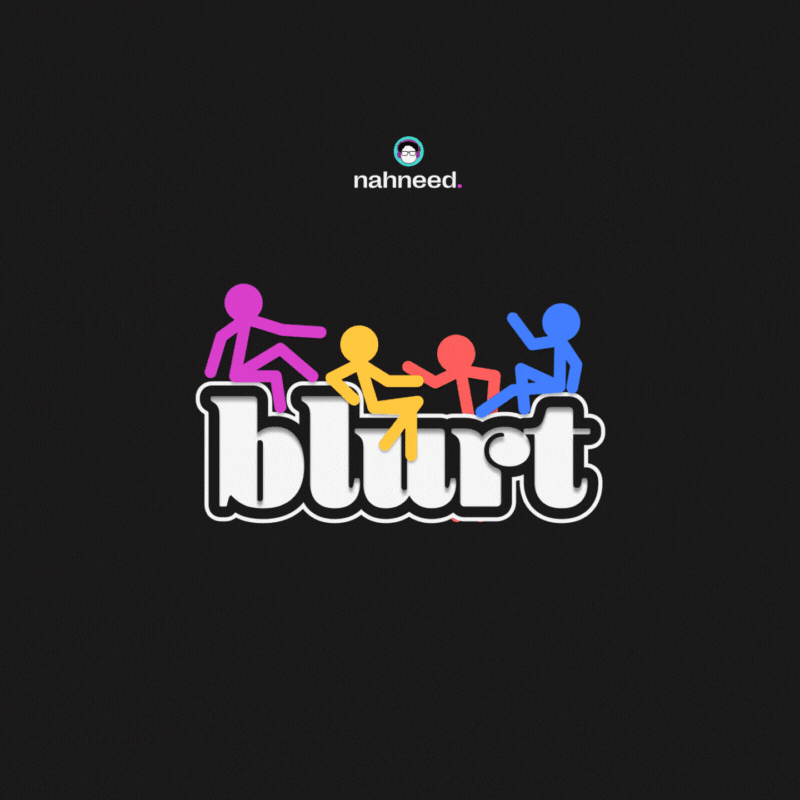

> Full-stack developer and AI engineer who builds production applications for real users.

- **AWS Certified Solutions Architect** - July 2025
- **Founded nahneed.** - Scaled to 50+ users in 1 month, reached startup competition finals
- Former **Software Developer Intern** at algoleap - Built AI pipeline reducing video review time by 70%
- **150+ LeetCode problems** solved across core DSA topics

**"Code is poetry, and I'm writing the next chapter."** ✨

*Last updated: July 2025*
